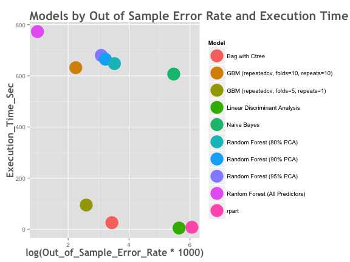

# Predict Manner of Exercise from Sensor Data

## Executive Summary

In this study, we have attempted to build a machine learning model to predict exercise effectiveness type from data recorded by body movement sensors. Our data source is the human activity recognition dataset (Source: [Human Activity Recognition][1]). From the available pre-classified data, we have trained machine learning models to predict the manner of exercise from sensor data. We have performed exploratory analysis to do basic clean-up and selection of appropriate prediction variables and have then evaluated several classification model algorithms using cross validation techniques. Finally, we have presented our observation on the relative effectiveness of the models.

## Data Source

Data to build the model: [https://d396qusza40orc.cloudfront.net/predmachlearn/pml-training.csv](https://d396qusza40orc.cloudfront.net/predmachlearn/pml-training.csv)

Data for final validation of the model: [https://d396qusza40orc.cloudfront.net/predmachlearn/pml-testing.csv](https://d396qusza40orc.cloudfront.net/predmachlearn/pml-testing.csv)

## Split the raw data into training and testing subsets

For cross-validation, we have split up the pml-training data to a training and testing dataset, with a 70/30 split. The "classe" variable is the variable that we are trying to predict, so the splitting accounts for that fact. 


```r
library(caret)
library(randomForest)

my_download <- function(url, filename) {
    if (! file.exists(filename)) {
        download.file(url=url, destfile=filename, method="curl")
    }
}

my_download("https://d396qusza40orc.cloudfront.net/predmachlearn/pml-training.csv", "data/pml-training.csv")
my_download("https://d396qusza40orc.cloudfront.net/predmachlearn/pml-testing.csv", "data/pml-testing.csv")

pml_train <- read.csv("./data/pml-training.csv", header=TRUE)
pml_test <- read.csv("data/pml-testing.csv", header=TRUE)

library(caret)
set.seed(12121)
inTrain <- createDataPartition(y=pml_train$classe, p=0.7, list=FALSE)
training <- pml_train[inTrain,]
testing <- pml_train[-inTrain,]
```


The training dataset has 13737 records and the testing dataset has 5885 records. Each dataset has a total of 160 variables. The "classe" variable is our prediction target, so let us take a look at it.


```r
classe_pcts <- round(table(training$classe) * 100.0 / dim(training)[1])
classe_pcts
```

```
## 
##  A  B  C  D  E 
## 28 19 17 16 18
```

So, the distribution of the classes is fairly even. Class A corresponds to the appropriate manner of the exercise, so it is the most common (28%) and the others are fairly evenly distributed.

## Selection of Prediction Variables

We have approached the method of selection of prediction variables in three ways.  
1. Eliminate variables that we do not believe are appropriate for prediction. To this end, we have eliminated a variable that is just a sequence number, the name of the person performing the exercise and timestamp related variables.  
2. Eliminate variables that have too many (over 90%) NA values. If some variables have a few NA values, we can impute them, but that was not the case here.  
3. Eliminate variables that have little variation across the dataset. This is done with the "nearZeroVariable" method.  
4. Handle factor variables if any. In this case, none were left after running through the first three steps.  

The details of this process is in appendix 1.1. We come up with a set of 53 prediction variables and we store them as predictionCols for usage in models.

While this is a substantial reduction from the original set of 159 variables, we are still interested to see if we can get good prediction from a smaller set. Since it is not easy to arbitrarily choose such variables without substantial exploratory analysis or domain knowledge, we have chosen the Principal Component Analysis (PCA) method to create a smaller set of variables that account for a reasonable percentage of the overall variation. Specifically, we have created 3 PCA variable sets that explain 80%, 90% and 95% of the variability respectively. The corresponding number of variables are 13, 19 and 25 respectively. The PCA selection code is in Appendix 1.2.

## Model Selection

We have applied a total of ten different classification models were to the training data set and calculated their efficiencies on the training data set. The results were cross validated against the testing data set so we can say with some measure of confidence that the prediction accuracy will hold good. In general, we assume that the accuracy observed on the testing set is our expectation of the accuracy of the model in predicting the "classe" variable. We have also tried to evaluate the models based on how long they take to build. This is important because in real world situations, the data would often be much larger than this data set (about 1000 times or more), so a slow model might simply be unusable. In order to compare models, we have used the same execution environment [n1-standard-8 (8 vCPUs, 30 GB memory) on Google Compute Cloud, CentOS 6.7 OS and R version 3.2.2]. Multicore processing was enabled using the doMC library and all available 8 cores were used.

#### Model 1 (RPart)

We use the most simplified tree classification model as our first try.


```r
modelFit_rpart <- train(x = training[,predictionCols], 
                        y = training$classe,
                        method="rpart")
trainingResults <- confusionMatrix(training$classe, 
                                   predict(modelFit_rpart, newdata=training[,predictionCols]))
testingResults <- confusionMatrix(testing$classe, 
                                   predict(modelFit_rpart, newdata=testing[,predictionCols]))
testingResults$table
```

```
##           Reference
## Prediction    A    B    C    D    E
##          A 1472   25  174    0    3
##          B  277  388  474    0    0
##          C  149   30  847    0    0
##          D  151  181  577    0   55
##          E   49   79  306    0  648
```

As we can see, the results are not promising. The accuracy in the training data set is 57.18% and it is 57.01% for the testing data set.   

In Sample error rate:  42.82%  
Out of Sample error rate:  42.99%

It is clear that we need to try more sophisticated alogrithms that include Bagging and Cross-Validation.

#### Model 2 (Random Forest)

Random Forest if often regarded as one of the most accurate classification models though prone to overfitting. We have used "cv" (cross-validation) as the resampling method with 5 folds.


```r
modelFit_rf_full <- train(x = training[,predictionCols], 
                          y = training$classe,
                          method="rf", 
                          trControl=trainControl(method="cv",number=5, allowParallel = TRUE), 
                          prox=TRUE)
```


```r
print(modelFit_rf_full$finalModel)
```

```
## 
## Call:
##  randomForest(x = x, y = y, mtry = param$mtry, proximity = TRUE) 
##                Type of random forest: classification
##                      Number of trees: 500
## No. of variables tried at each split: 27
## 
##         OOB estimate of  error rate: 0.32%
## Confusion matrix:
##      A    B    C    D    E  class.error
## A 3904    1    0    0    1 0.0005120328
## B    5 2647    5    1    0 0.0041384500
## C    0    8 2387    1    0 0.0037562604
## D    0    0   10 2241    1 0.0048845471
## E    0    1    0   10 2514 0.0043564356
```

```r
trainingResults <- confusionMatrix(training$classe, 
                                   predict(modelFit_rf_full, newdata=training[,predictionCols]))
testingResults <- confusionMatrix(testing$classe, 
                                  predict(modelFit_rf_full, newdata=testing[,predictionCols]))

res <- cbind(data.frame(trainingResults$overall),
      data.frame(testingResults$overall)[,1])
colnames(res) <- c("Training", "Testing")
res
```

```
##                 Training   Testing
## Accuracy       1.0000000 0.9972812
## Kappa          1.0000000 0.9965607
## AccuracyLower  0.9997315 0.9955886
## AccuracyUpper  1.0000000 0.9984452
## AccuracyNull   0.2843416 0.2853016
## AccuracyPValue 0.0000000 0.0000000
## McnemarPValue        NaN       NaN
```

The calculation was slow (about 13 minutes) but the accuracy of the results look highly promising. Our accuracy in prediction of the testing data set is an amazing 99.73%. Out of sample error rate is 0.27%

Because the model building was very slow, we are doubtful about handling this model if that training data set was 14 million records (or may be 140 million records) instead of the 14 thosand records we are handling here. So, we proceed to try the reduced variable scenarios we can create using our pre-performed PCA analysis.

#### Model 3, 4, 5 (Random Forest with PCA dependent variables (80%, 85% and 90%))

The appropriate model building codes are in Appendix 1.3. We observe that the model building process becomes faster but does not improve substantially. The case with 80% PCA builds in 11 minutes, but accuracy in predicting the testing data set falls to 96.62%. As we increase the PCA percentage, accuracy and time to build increases. We can conclude that we do not gain much by using PCA in thie case.  

So, while "Random Forest" performed really well in its power of prediction, it was a very slow model building process even with a training data set of the size of about 14000 records. We cannot be confident that we can use this model if our data set has tens or hunderds of mullons of records as is so often the case with big data. With that in mind, we explored a few other models as well.

#### Model 6 (Linear Discriminant Analysis or LDA)

Under certain circumstances, using a probablistic model like LDA or Naive Bayes work well as well. The LDA method (code in Appendix 1.4)


The LDA method is very fast (took only 5 seconds to run), but the accuracy on the testing set is 71.51% is not very encouraging and the out of sample error rate is consequently high at 28.49%. This may not be acceptable in many real life situations.

#### Model 7 (Naive Bayes)

Next, we tried the Naive Bayes classifier. Code is in Appendix 1.5.


This was not a great success. The model building time was high (almost 10 monutes), and the accuracy on the testing set (75.6%) and out of sample error rate (24.4%) were not much of an improvement with LDA. Also, the prediction process itself seemed to be much slower than any of the other models. We would not choose this model as a winner in this scenario.

#### Model 8 and 9 Gradient Boosting with Trees (GBM)

The Gradient Boosting with trees methos was tried next. We used "repeatedcv" (Repeated Cross Validations) in with two different combinations for folds and repeats. The code is in Appendix 1.5.


With 10 folds and 5 repeats, the model building process is slow (about 10.5 minutes) and the out of sample error is 0.95% which is good but not as good as Random Forest.


However, with 5 folds and 1 repeat, the model built very fast (about 1.5 minutes) and the out of sample error rate remained quite low at 1.34%. This is definitely a promising result.

#### Model 10 Bagging with Tree Bag

For our last model, with tried the bagging method using ctree available in in party package. The code is in Appendix 1.6.


This model is very good for both accuracy / out of sample error and time to build the model. The model built in jus 27 seconds and the out of sample error rate was 3.11%. So if an accuracy of 96.89% is acceptable, this is a very quick model compared to Random Forest.

## Final Thoughts

We summarize our model selection with some factual comparisons between the models we tried. The table below shows our findings. We have used a somewhat arbitrary formula of [Out Of Sample Error Rate] * [Execution Time] to rank these, which can change according to individual preferences. But most important thing to note is that execution time to build the model might be critical to the success of the entire project and it must be looked into as well in addition to the prediction accuracy / error. We have also plotted our models based on these two variables.


|Model                                  | Execution_Time_Sec| Accuracy_Testing| Out_of_Sample_Error_Rate| Compressed_Model_Size_MB| ranking|
|:--------------------------------------|------------------:|----------------:|------------------------:|------------------------:|-------:|
|Bag with Ctree                         |                 26|           0.9689|                   0.0311|                    214.0|       1|
|GBM (repeatedcv, folds=5, repeats=1)   |                 95|           0.9866|                   0.0134|                      5.5|       2|
|Ranfom Forest (All Predictors)         |                773|           0.9973|                   0.0027|                     84.0|       3|
|Linear Discriminant Analysis           |                  5|           0.7183|                   0.2817|                      1.9|       4|
|GBM (repeatedcv, folds=10, repeats=10) |                632|           0.9905|                   0.0095|                      6.6|       5|
|rpart                                  |                  8|           0.5700|                   0.4300|                     17.0|       6|
|Random Forest (95% PCA)                |                680|           0.9781|                   0.0219|                     60.0|       7|
|Random Forest (90% PCA)                |                665|           0.9749|                   0.0251|                     56.0|       8|
|Random Forest (80% PCA)                |                648|           0.9662|                   0.0338|                     52.0|       9|
|Naive Bayes                            |                607|           0.7633|                   0.2367|                      5.1|      10|



## Appendix

### Appendix 1.1 Selection of Prediction Variables


```r
findNA <- function(inp) {
        for (i in 1:dim(inp)[2]) {
                colname <- colnames(inp)[i]
                colclass <- class(inp[,i])
                pctNA <- mean(is.na(inp[,i]) * 1)
                if (colclass == "factor") {
                        # print(colname)
                        pctNA <- mean(grepl("^\\s*$", as.character(inp[,i])) * 1)
                }
                df = data.frame(colname = colname, colclass = colclass, pctNA = pctNA)
                if (i == 1) {
                        dfret = df
                }
                else {
                        dfret <- do.call(rbind, list(df, dfret))
                }
        }
        dfret
}

naSummary <- findNA(training)
dim(naSummary[naSummary$pctNA <= 0.9,])

predictionCols <- naSummary[naSummary$pctNA <= 0.9 & ! naSummary$colname %in% c("classe","X"),]$colname
predictionCols <- as.character(predictionCols)
predictionCols

## Find variables with little variance - Near Zero
nsv <- nearZeroVar(training[,as.character(predictionCols)], saveMetrics = TRUE)
nsv[nsv$nzv,]
predictionCols <- predictionCols[! predictionCols %in% as.character(row.names(nsv[nsv$nzv,]))]

predictionCols <- predictionCols[! predictionCols %in% c("cvtd_timestamp", 
                                                         "raw_timestamp_part_1",
                                                         "raw_timestamp_part_2",
                                                         "user_name")]
```

### Appendix 1.2 PCA


```r
library(caret)

set.seed(12123)
preProc_80 <- preProcess(training[,predictionCols], method="pca", thresh = 0.8)
preProc_90 <- preProcess(training[,predictionCols], method="pca", thresh = 0.9)
preProc_95 <- preProcess(training[,predictionCols], method="pca", thresh = 0.95)
```

### Appendix 1.3 Random Forest with PCA


```r
## The code below trains the Random Forest model with 80% PCA. The code can be altered to calculate for 90% and 95% PCA.
pca_train_80 <- predict(preProc_80, training[,predictionCols])
pca_test_80 <- predict(preProc_80, testing[,predictionCols])

system.time({
        modelFit_rf_pca80 <- train(x = pca_train_80, 
                                  y = training$classe,
                                  method="rf", 
                                  trControl=trainControl(method="cv",number=5, allowParallel = TRUE), 
                                  prox=TRUE)
})

print(confusionMatrix(training$classe, predict(modelFit_rf_pca80, newdata=pca_train_80)))
print(confusionMatrix(testing$classe, predict(modelFit_rf_pca80, newdata=pca_test_80)))
```

### Appendix 1.4 LDA


```r
modelFit_lda <- train(x = training[,predictionCols], 
                      y = training$classe,
                      method="lda")

print(confusionMatrix(training$classe, predict(modelFit_lda, newdata=training[,predictionCols])))
print(confusionMatrix(testing$classe, predict(modelFit_lda, newdata=testing[,predictionCols])))
```

### Appendix 1.5 GBM


```r
model_gbm <- function(folds, repeats) {
        fitControl <- trainControl(method = "repeatedcv",
                                   number = folds,
                                   repeats = repeats,
                                   ## Estimate class probabilities
                                   classProbs = TRUE)
        
        modelFit_gbm_simple <- train(x = training[,predictionCols],         
                                     y = training$classe,
                                     method = "gbm",
                                     verbose = FALSE,
                                     trControl = fitControl)
        modelFit_gbm_simple
}

modelFit_gbm_simple <- model_gbm(10, 5)
modelFit_gbm_simple2 <- model_gbm(5, 1)
```

### Appendix 1.6 Bagging with ctree

```r
modelFit_treebag <- bag(training[,predictionCols], 
                        training$classe,
                        B = 10,
                        bagControl = bagControl(
                                fit = ctreeBag$fit,
                                predict = ctreeBag$pred,
                                aggregate = ctreeBag$aggregate
                        ))
print(confusionMatrix(training$classe, predict(modelFit_treebag, newdata=training[,predictionCols])))
print(confusionMatrix(testing$classe, predict(modelFit_treebag, newdata=testing[,predictionCols])))
```

[1]: http://groupware.les.inf.puc-rio.br/har
